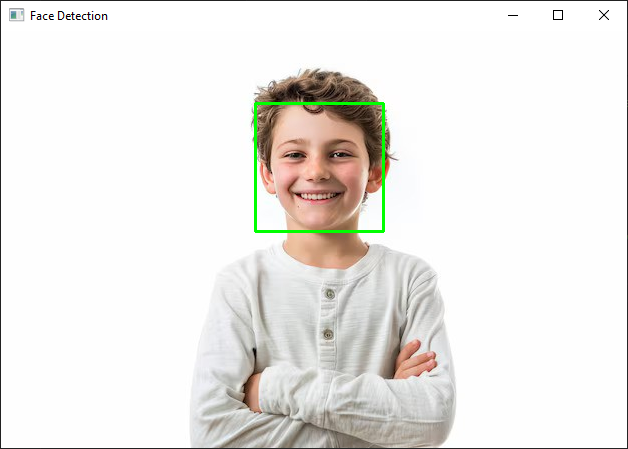

# Face Detection with OpenCV

This project demonstrates face detection from `real-time` or `static-image-file` using OpenCV's Haar Cascade classifier. In the real-time face detection program captures video from your webcam, detects faces in each frame, and draws rectangles around the detected faces on both project. If the camera is not detected or the image file is not found then programs will printing a alert!!

## Requirements

- Python 3.x
- OpenCV

## Installation

1. Clone the repository:
    ```sh
    git clone https://github.com/flameAutomation/Face-Detection-OpenCV.git
    cd Face-Detection-OpenCV
    ```

2. Install the required dependencies:
    ```sh
    pip install opencv-python
    ```

## Usage

1. Run the script:
    ```sh
    python face_detection_image.py
    ```

> If the image is not detected, "Error: Unable to read image file `unknown_path`" will be printed. <br><br>
> This Python script uses OpenCV's Haar Cascade classifier to detect faces from a static image file.

or, Detect real-time face by using a webcam

2. Run the script:
    ```sh
    python face_detection_webcam.py
    ```

> If the camera is not detected, "Camera not responding" will be printed 50 times. <br><br>
> If the camera is detected, a window will open displaying the video feed from your webcam with rectangles drawn around detected faces. <br><br>
> Press the `z` key to exit the program.

## Example

|  | 
|:--:|:--:|
| *Before* | *After* |

## Code Explanation

```python
# Import necessary libraries
import cv2
```

```python
# Load the pre-trained Haar Cascade classifier for face detection
faceCascade = cv2.CascadeClassifier(cv2.data.haarcascades + 'haarcascade_frontalface_default.xml')
```

```python
# Capture video from the default camera (usually the webcam)
cap = cv2.VideoCapture(0)
```

```python
# Function to detect faces in an image file
def detect_faces_in_image(image_path):
```

```python
# Read the image from file
image = cv2.imread(image_path)
```

```python
# Check if the camera is opened successfully
if not cap.isOpened():
    print("Error: Camera not responding!")

# Check if the image is opened successfully
if image is None:
    print(f"Error: Unable to read image file '{image_path}'")
    return
```

```python
# Read a frame from the video feed
ret, frame = cap.read()
```

```python
# Convert the frame to grayscale
gray = cv2.cvtColor(frame, cv2.COLOR_BGR2GRAY)

# Convert the image to grayscale
gray = cv2.cvtColor(image, cv2.COLOR_BGR2GRAY)
```

```python
# Detect faces in the grayscale frame
faces = faceCascade.detectMultiScale(gray, scaleFactor=1.3, minNeighbors=5)

# Detect faces in the grayscale image
faces = faceCascade.detectMultiScale(gray, scaleFactor=1.3, minNeighbors=5)
```

```python
# Draw rectangles around the detected faces
for (x, y, w, h) in faces:
    cv2.rectangle(frame, (x, y), (x+w, y+h), (0, 255, 0), 2)
```

```python
# Display the frame with rectangles in a window
cv2.imshow('Face Detection', frame)

# Display the image with rectangles around faces
cv2.imshow('Face Detection', image)
cv2.waitKey(0)
cv2.destroyAllWindows()
```

```python
# Example usage
if __name__ == "__main__":
    image_path = 'demo.jpg' # Replace file path
    detect_faces_in_image(image_path)
```
        
```python
# Break the loop if 'z' is pressed
if cv2.waitKey(90) & 0xFF == ord('z'):
    break
```

```python
# Release the video capture object and close all OpenCV windows
cap.release()
cv2.destroyAllWindows()
```
